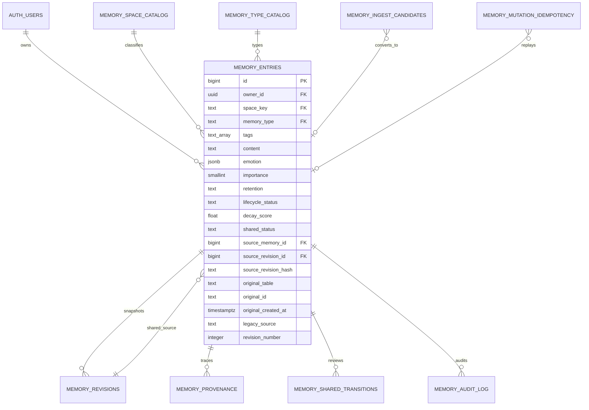

# Memory System 第二阶段数据库设计

状态：`DRAFT` / `ZERO_COST_VALIDATED` / `NO_PRODUCTION_CHANGE` / `NO_LEGACY_BODY_IMPORT`

本阶段只建立统一规范结构并在一次性测试环境验证。没有创建付费 Supabase Branch，没有绑定或修改支付方式，没有执行生产 SQL，也没有读取或迁移生产记忆正文。

## 1. Schema / ER



四个逻辑空间只有一个规范正文表 `memory_entries`：

| space | 用途 | 日常 recall |
|---|---|---|
| `gpt` | GPT 私有记忆 | GPT 可读 |
| `claude` | Claude 私有记忆 | Claude 可读 |
| `shared` | 明确进入审批流程的共同记忆 | 仅 `approved` 可被双方读 |
| `legacy_pending` | 冻结的旧正文待整理区 | 永不自动读取 |

`space_key`、`memory_type`、`tags` 是三个独立维度。GPT/Claude 不能作为 tag；日记/感受等不能作为 namespace。

### 新表职责

| 表 | 职责 |
|---|---|
| `memory_space_catalog` | 四个空间的稳定目录 |
| `memory_type_catalog` | 记事、感受、日记、文章、小事记、备忘录、问心、语录、总结、观点 |
| `memory_entries` | 唯一规范记忆正文与生命周期字段 |
| `memory_revisions` | 每次正文变更的不可变快照 |
| `memory_provenance` | 创建、整理、修订、Shared 审批的来源链 |
| `memory_shared_transitions` | Shared 状态变化的不可变流水 |
| `memory_audit_log` | 允许/拒绝/错误访问的元数据审计，不存正文 |
| `memory_mutation_idempotency` | mutation 的数据库级幂等声明；唯一边界为 owner + actor + operation + request id |
| `memory_ingest_candidates` | Dreaming/摘要候选生命周期；候选不等于正式记忆 |

## 2. 旧字段到新结构的映射

本表只定义未来受控导入的结构映射，不执行正文迁移。

| 旧来源/字段 | 新结构 | 说明 |
|---|---|---|
| `brain.content`, `memories.content` | `memory_entries.content` | 未来只允许导入 `legacy_pending`，本阶段不复制 |
| `brain.kind` | `memory_type` | `记事→fact`，`记感受→feeling` |
| `brain.tag` | `memory_type` 或 `tags[]` | 日记/文章/语录/总结/观点属于 type；主题词属于 tags，导入时显式映射 |
| `memories.category` | `memory_type` + `tags[]` | 不能直接把混合字段原样当 namespace |
| `brain.feeling`, `brain.mood` | `emotion` JSON | 保留 label、note、intensity 等可扩展结构 |
| `brain.is_special`, `memories.importance` | `importance` + tags/metadata | 统一为 1–5，旧布尔标记不能静默丢失 |
| `memories.level` | `retention` | 固定/长期/短期/临时映射为 fixed/long/short/temporary |
| `brain.status` | `lifecycle_status` | active/faded/awakened/archived |
| `brain.decay_score` | `decay_score` | 0–1 |
| `brain.awaken_count` | `awaken_count` | 非负整数 |
| `brain.last_awakened_at` | `last_awakened_at` | 潮汐/唤醒时间 |
| `brain.last_accessed_at` | `last_accessed_at` | 未来 decay 计算依据 |
| `brain.author` | `author` | 保留原作者 |
| `author`, `source_model` | 同名字段 | 保留已有模型/作者来源 |
| `source_table`, `source_id` | `original_table`, `original_id` | Legacy Pending 必填来源 |
| 旧行 `created_at` | `original_created_at` | 新行的 `created_at` 是暂存时间，不能覆盖原时间 |
| 旧系统/批次名 | `legacy_source` | 例如 brain-v1/memories-v1 |
| `brain.ref_id` | provenance parent chain | 需人工确认语义后再映射，不自动猜测修订关系 |
| `memory_candidates` | `memory_ingest_candidates` | 继承 pending/approved/rejected/merged 生命周期，不自动写正式记忆 |
| `window_summaries` | candidate 的 source 字段 | 摘要是候选来源，不自动成为 Shared |
| `dream_runs` | candidate 的 `dream_run_ref`/source metadata | 保留运行链路；运行日志本身不是记忆正文 |
| `active_threads` | 后续独立话题结构 | 不强塞进规范记忆正文；仅在形成候选时建立 provenance |

旧 migration `20260808174047_memory_namespace_v1.sql` 会把旧内容默认设为 Shared，与最终规则冲突。本阶段的免费 CI **只复制并执行 V2 migration**，明确排除该旧文件；它仍禁止用于生产。

## 3. Shared 状态机

```text
private memory
      │ 独立申请（未来 Curator 流程）
      ▼
candidate ──批准──> approved ──撤销──> revoked
    └────拒绝──> rejected
```

- Shared 新行只能由 Curator 以 `candidate` 创建，并且必须绑定同一 owner 私有记忆的 `source_memory_id + source_revision_id`。
- 数据库从该 revision 复制完整快照并计算 `source_revision_hash`，忽略客户端传入的正文和 hash；源记忆后续产生新 revision 不会让 candidate 漂移。
- candidate/approved/rejected/revoked 正文和来源绑定全部不可修改。选错 revision 必须 reject 后创建新的 candidate。
- `memory_revisions` 另有插入校验：Shared 只能拥有与快照完全一致的第 1 版，禁止通过直接插入 revision 2 偷换正文。
- GPT/Claude 普通 MCP 不能创建、批准、拒绝或撤销 Shared。
- 只有 Owner 可以执行 `candidate → approved/rejected` 与 `approved → revoked`；Curator/system/GPT/Claude 均无决定权。
- rejected 与 revoked 都是终态；禁止 candidate → revoked、rejected → candidate/approved、revoked → approved。
- `approved` 对 GPT/Claude 仍为只读；未来写入只能走独立申请/批准工具。
- 每次变化同时写入 `memory_shared_transitions` 与 `memory_provenance`。

## 4. Revision 与 provenance

- 新记忆自动生成 revision 1 和初始来源事件。
- 正文、标题、author、type、tags、emotion、importance、retention、lifecycle 任一变化，都必须同时提交新的 `updated_by_actor` 与 `revision_reason`。
- 触发器自动递增 `revision_number` 并保存完整快照；直接 UPDATE/DELETE 历史表会被拒绝。
- owner、space、初始来源、Legacy 原始来源在正文行上不可静默改写。
- provenance 记录 parent/source、actor、reason、时间及来源元数据，可以回答“最初来自哪里、经过什么修订、为何进入当前空间”。
- Shared provenance 同时保存 `parent_memory_id`、`parent_revision_id` 和数据库计算的 revision hash。
- provenance 与 Shared transition 使用 `(revision_id, memory_id, owner_id)` 复合外键，避免跨 owner 或跨 memory 拼接来源链。

## 5. Audit

`memory_audit_log` 是 append-only 元数据表，记录：owner、actor、action、memory id、space、allowed/denied/error、拒绝原因、结果数量/空间、request id 和时间。禁止保存记忆正文。

Bridge 已增加 `SupabaseMemoryAuditSink` 合约，但 `server.js` 仍未安装该 sink，`writeEnabled` 仍为 false。只有 migration 独立审阅、持久化审计接通并获得生产授权后，才有资格讨论开启写入。

### Mutation idempotency

- `memory_mutation_idempotency` 的唯一约束是 `(owner_id, actor, operation, request_id)`。
- 插入时必须提供规范化 JSONB request material；数据库触发器计算 SHA-256 `request_hash`，覆盖任何客户端 hash，并在落库前清除原始 request material。
- `memory_claim_idempotency()` 对同 request id + 同 hash 返回原声明及 resource；同 request id + 不同 hash 以唯一冲突失败。
- 幂等行身份/hash 不可修改，只允许 `started → completed`。完整 mutation 事务调用留给 Phase 3。

## 6. 两层权限防线

### 数据库层

- 九张新表全部启用 RLS；`anon` 无权限，`authenticated` 只能读取自己的 owner 行，并且不能读取内部 idempotency 表。
- 普通登录用户没有正文写权限。
- 触发器约束空间/创建 actor、Legacy 来源、Shared 初始状态、审批人与修订理由。
- 六个只授予 `service_role` 的固定 RPC 是 GPT/Claude 的数据库读门：`memory_get_*`、`memory_list_*`、`memory_recall_*`。函数名固定 actor，参数不接受 actor/space/namespace。
- RPC 内部固定为“自己的私有空间 + approved Shared”，不会返回另一方私有记忆、未批准 Shared 或 Legacy Pending。

### 应用层

- MCP Adapter 在服务端固定 actor；AccessPolicy 拒绝伪造 namespace/space。
- Repository 强制注入 `OWNER_USER_ID`，缺失时 fail closed。
- Repository 的读取只调用固定 actor RPC，不直接拼接 `memory_entries` WHERE。
- MemoryService 仍对返回结果再次执行 `canRead`，防止 Repository/后端回归。
- service/secret key 确实绕过 RLS，因此测试明确证明：直接 service role 能见全表，但规范 Repository 经过固定 RPC 后仍受空间隔离。不得把 service key 下发前端。

### 权限矩阵

| 通道 | GPT private | Claude private | approved Shared | candidate/rejected/revoked Shared | Legacy Pending |
|---|---|---|---|---|---|
| GPT MCP | 读写 | 拒绝 | 只读 | 拒绝 | 拒绝 |
| Claude MCP | 拒绝 | 读写 | 只读 | 拒绝 | 拒绝 |
| 登录主人 | RLS 下可审阅 | RLS 下可审阅 | 可审阅 | 可审阅 | 可整理 |
| service role 原始表 | 技术上可见 | 技术上可见 | 技术上可见 | 技术上可见 | 技术上可见 |
| Bridge 规范 Repository | 依固定 actor | 依固定 actor | 只读 | 永不返回 | 永不返回 |

## 7. 零付费验证方案

使用 public GitHub 仓库的 GitHub Actions runner 启动一次性本地 Supabase Docker 栈：

1. 创建隔离 workdir，只复制 V2 migration；不链接任何 Supabase 云项目。
2. fresh install 后执行 SQL 测试和 `supabase db lint`。
3. 执行显式 rollback，确认所有 V2 对象均已删除。
4. 重新应用 migration 并重跑 SQL 测试，证明 migration 可重复验证。
5. `if: always()` 停止容器并删除本地数据。

该流程不创建 Supabase Branch、不需要云数据库密码、不修改生产项目，也不产生 Supabase Branch 费用。测试数据使用 `.invalid` 邮箱和固定假 UUID，并在 SQL transaction 末尾 rollback。

## 8. 测试清单

- fresh install / transaction failure 回滚
- migration 显式 rollback / re-apply
- 四空间目录与 space/type/tag 分离约束
- GPT、Claude 各自私有写入
- GPT 固定 RPC 不返回 Claude；Claude 固定 RPC 不返回 GPT
- 双方读取 approved Shared
- candidate Shared 不可读取；直接 approved 创建失败
- candidate 固定 private revision；错误 revision 绑定失败；源记忆更新后 candidate 不漂移
- candidate/approved Shared 正文不可修改，Shared 永远只有 revision 1
- 仅 Owner 可 approve/reject/revoke；非法状态边全部失败
- 数据库计算 revision/request hash，不信任客户端 hash
- 幂等同请求安全重放、不同 payload 冲突、原始 request material 不落库
- Legacy Pending 来源字段强制完整，且不进入日常读取
- Legacy 专属关键词返回 0；高 importance Legacy 不影响允许结果的数量和排序
- actor 名称作为 tag 被拒绝
- 静默正文覆盖失败；合法修订可追溯
- Shared candidate/approved transition 可追溯
- Legacy 原始来源 provenance 可追溯
- audit 持久化与 append-only
- owner RLS 隔离
- service role 绕过 RLS 的已知事实 + 固定 RPC 的第二道过滤
- Bridge owner 缺失 fail closed、scope 伪造失败、MCP actor/space 伪造失败

第一版零付费数据库验证曾通过 [run 31274614880](https://github.com/zhangxiaolu712-ops/lovehouse/actions/runs/31274614880)。本次工程审阅修订必须在同一免费流程重新完成 fresh install、SQL 测试、lint、rollback、re-apply 与复测，最终 run 在二轮审阅报告中记录。

## 9. Rollback

测试回滚文件按依赖顺序删除固定 RPC、新表与触发器函数。它只用于空的临时验证库。

生产环境未来若已经写入新数据，禁止直接执行 DROP rollback；应先暂停写入、导出新表、校验备份、评估向后 migration，再由主人批准。当前阶段生产没有这些表，因此不存在生产回滚动作。

## 10. 尚未解决与第三阶段建议

- 生产 `livingroom` RLS、`brain` policy、Dreaming `allow_all` 是独立 P0 PR，本 PR 不修。
- 旧正文仍全部冻结；V2 不含 Legacy 导入 DML。
- `active_threads` 的未来规范需要单独设计，不能为了兼容旧表污染 memory_entries。
- 当前搜索是固定 RPC 的文本匹配；embedding/向量检索需在权限过滤之后独立设计。
- Shared 申请/批准 UI 与 Curator MCP 尚未实现。
- persistent audit sink 尚未在生产 Bridge 启用；`MEMORY_SYSTEM_ENABLED` 仍必须保持 false。
- 第三阶段应先在得到明确授权后建立非生产环境/受控迁移演练，再实现 Legacy dry-run 清单、Curator 工具与备份校验；仍不得自动猜历史归属。
