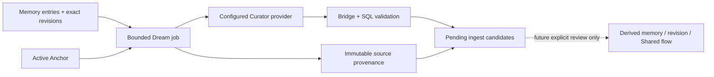

# Memory System Phase 4B：Dream 基础层

状态：Draft 实现，默认关闭，未部署生产。

## 目标与边界

Phase 4B 在 Phase 4A recall 之上增加三项内部能力：

- Anchor：每个 owner + actor 最多 12 个有效固定点；固定记录绑定当时的精确 revision/hash，释放后历史仍保留。
- Dream Queue：每个任务最多 4 个近期或 Anchor 来源，每条输入最多 6000 字，总输入最多 24000 字。
- 可替换 Curator：Bridge 只依赖 `curate(job)` provider 接口；provider/model 是运行配置，不是数据库枚举。

本阶段不增加 MCP 工具，不改变 AI-facing recall 参数，不做情感模块、自动日记、盲盒、潮汐或 Legacy 整理。

## 数据流



Curator 没有数据库权限，只能收到由固定 actor RPC 生成的限长快照，并通过受控 completion RPC 提交候选。

## Schema

| 对象 | 职责 |
| --- | --- |
| `memory_anchor_records` | 有效 Anchor 与释放历史；不修改记忆正文 |
| `memory_dream_jobs` | pending/processing/completed/failed 队列、lease、attempt、provider/model、输出 hash |
| `memory_dream_job_sources` | job 输入的 exact memory/revision/hash、dream actor、source actor |
| `memory_ingest_candidates` 扩展 | `proposal_kind`、Dream identity、revision suggestion target；仍默认 pending |
| `memory_ingest_candidate_sources` | 每条候选到 exact source revisions 的不可变 provenance |

三种 `proposal_kind` 都只是 pending candidate：

- `derived_memory`
- `revision_suggestion`
- `shared_candidate`

它们不会直接创建/修改 `memory_entries` 或 `memory_revisions`。Shared recommendation 也不会自动成为 approved Shared。

## 固定 actor 内部 RPC

每项都有 GPT/Claude 两个 wrapper，actor 不作为参数传入：

- `memory_behavior_set_anchor_{gpt|claude}`
- `memory_behavior_list_anchors_{gpt|claude}`
- `memory_behavior_enqueue_dream_{gpt|claude}`
- `memory_behavior_claim_dream_{gpt|claude}`
- `memory_behavior_complete_dream_{gpt|claude}`
- `memory_behavior_fail_dream_{gpt|claude}`

只有 `service_role` 可执行 wrapper；它仍无权直接读写 Phase 4B 表或调用 internal actor 参数函数。`authenticated` 只有 owner RLS 下的只读能力。

## 安全不变量

- SQL eligible relation 只包含 actor private + approved Shared；Legacy Pending 和另一方 private 从查询阶段排除。
- job source 固定 `source_memory_id + source_revision_id + source_revision_hash`，源记忆后续 revision 不会使任务漂移。
- 同一 owner + dream actor + exact source revision 只进入一次队列，避免后台反复消耗 token。
- candidate 的 actor/space/owner/provider/provenance 由数据库和 Bridge 注入，忽略 Curator 伪造的权力字段。
- completion 是一个事务；任一 output 失败时，所有 candidate/source insert 一起回滚。
- Anchor 有数量上限，且记录只能执行一次 active → released；正文和 revision 从不被 Anchor 改写。
- Dream 默认关闭；`MEMORY_SYSTEM_ENABLED` 与 `MEMORY_DREAM_ENABLED` 必须同时为 true 才会启动 worker。

## Runtime 配置

```text
MEMORY_DREAM_ENABLED=false
MEMORY_DREAM_CURATOR_PROVIDER=openai-compatible | deepseek-compatible | custom
MEMORY_DREAM_CURATOR_URL=https://.../chat/completions
MEMORY_DREAM_CURATOR_API_KEY=server-only
MEMORY_DREAM_CURATOR_MODEL=provider-model
MEMORY_DREAM_INTERVAL_MS=300000
```

API key 只存在 Bridge 服务端。换 provider/model 不需要 migration。

## 回滚

回滚顺序为：撤销固定 RPC → 删除 candidate provenance → 删除 Phase 4B pending Dream candidates → 移除候选扩展列 → 删除 queue/anchor 表。回滚不会删除或修改任何 canonical memory/revision。

## 验证计划

- Phase 2/3/4A 完整回归。
- fresh install、Phase 4B rollback/reinstall、full rollback/clean reinstall。
- Anchor exact revision、跨空间拒绝、12 条上限、释放历史不可篡改。
- GPT/Claude、owner、approved Shared、Legacy SQL 级隔离。
- Dream 输入数量/长度限制与 exact revision provenance。
- GPT/DeepSeek 风格 provider 替换无需 schema 修改。
- 三类输出始终为 pending candidate；authority spoofing 无效。
- 部分输出失败时 candidate/memory/revision 均零污染。
- Dream disabled 时不调用 repository/provider。

## 尚未实现

- candidate 的 Owner/Curator 审批与正式转换流程。
- Anchor 的 Owner UI 与是否影响 recall 排序的产品决策。
- 情绪聚类、自动日记、盲盒、潮汐、Legacy 整理。

